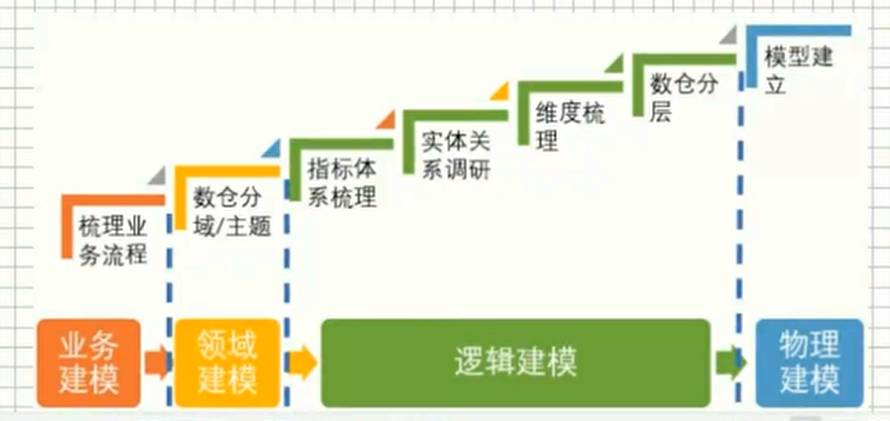

# 老王视频学习笔记

## 0. 简介

【老王漫谈数仓】

业务数据化，数据业务化

## 1. 数仓分层

- 一般分为：ODS（操作层）、DW（数仓层）、APP三层；
- ODS层
  - 结构尽量同源数据一致，不做数据清洗和加工
  - 表名规范：ODS_数据源_表名_标记（全量/增量）
  - 抽取工具：sqoop、埋点日志
  - 抽取工具：flume、spark streaming、flink
  - 初步清理：
    - 去噪，去除异常数据，如年龄200岁
    - 去重
    - 字段命名规范
- DW层
  - 细分为：DWD、DWM、DWS层
  - DWD与ODS层一样的数据粒度
  - DWD目标：确保数据质量，数据清洗
  - DWS目标，对外服务，一般大宽表，用于维度设计（客户、xxx）
- APP层
  - 数据集市，根据业务组建数据集市

## 2.数据分层质量的评判

- 模型完善度
- 业务覆盖度
  - 各层，各表，被调用的次数。找到长期未被使用的数据表；
  - 存量库中，未识别归属分层的表，占总表的比例
  - 除DWD层外，其余各层直接读取ODS的表占比，越高说明DW层设计不完善，中间层模型复用性差
- DWD层的完善度
  - 覆盖率：ods层有多少表被dwd调用，哪些ods从未被调用
- DWS、APP层，有多少表被查询所使用
- 失效稳定度，每日跑批的时间、数据完成的时间点稳定度

## 3.数据探查：了解业务场景

建设数仓全流程图：

 七步骤：

1. 梳理业务流程
2. 垂直切分（划分主题域）
3. 指标体系梳理
4. 表实体关系调研
5. 维度梳理
6. 数仓分层
7. 物理模型建立

数据探查过程

1. 业务调研
   - 1）用户的组织架构和分工
   - 2）整体业务架构、流程（产出：数据框架、业务流程）
     - 核心业务流程：谁，在什么环节，做了什么（关键动作）、得到结果
     - 找出用户认为的问题、痛点描述、期望
   - 3）梳理已有业务板块的主要功能及数据从哪里获取
2. 需求分析
   - 根据业务人员沟通获取需求
   - 研究报表，分析需求
     - 1. 沉淀出指标，指标的定义口径
     - 2. 业务数据是根据什么（维度、粒度）汇总
     - 3. 思考：明细数据和汇总数据应该如何设计
     - 4. 数据是否要冗余、沉淀到汇总数据层中
3. 数据调研
   - 候选数据源
   - 1. 数据字段是否能满足需求
   - 2. 表的数据结构
   - 3. 表的数据内容质量
     - 1. 数据是否完整？是否有空白或空值
     - 2. 数据是否唯一？有多少不同值？数据是否重复
     - 3. 数据是否存在异常格式？数据格式的分布？
     - 4. 数据存在哪些值范围？是否符合预期？给定的数，最大最小和平均值是什么？
   - 4. 决定数据表量同步策略？是增量还是全量同步 

## 3. 数据团队

- 主要工作岗位
  1. 数据平台构建
     1. 大数据平台开发，拼接各种组件
     2. 数据平台运维
     3. 数据系统开发（后端开发）
        - 系统：调度、元数据管理、指标管理、数据接入、报表系统、资产管理等
     4. 数据架构（数据架构师）
        - 技术栈选型、技术架构，考虑未来成本
  2. 数据基础建设 ***（ETL、数仓开发、数仓专家、数据治理）
     1. 数据采集，数据探查
     2. 数仓模型
     3. 元数据管理
        - 血缘分析：数据来自哪里，经过哪些加工
        - 影响分析：数据去了哪里，经过哪些加工
        - 冷热都分析：哪些数据常用，哪些属于僵死状态
        - 关联度分析：数据之间的关系
        - 数据资产地图：有哪些数据，在哪里可以找到这些数据，可以用这些数据干什么！
     4. 指标体系：监控业务情况
        - 最关注的问题
        - 情况回溯，用数据找到根源
     5. 数据治理
        - 数据质量治理
        - 数据知产治理
     6. 用户画像
  3. 数据分析师
  - 临时取数
  - 分析报告
  4. 数据挖掘
  - 算法工程师，做模型
  - 数据挖掘工程师
  5. 数据产品（产品经理）
     1. 公司内部，数据埋点、标签体系
     2. 公司外部
  6. 数据运营，用数据提升运营
     1. 数据收集
     2. 数据分析
     3. 数据决策

