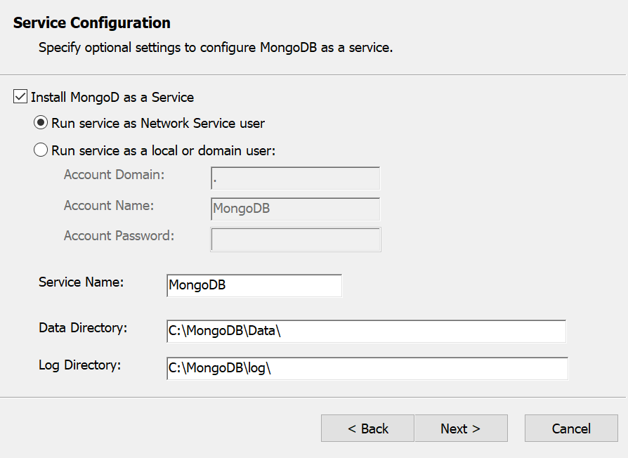
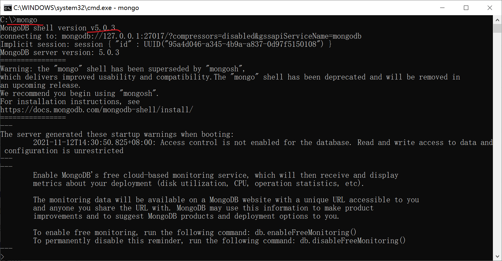
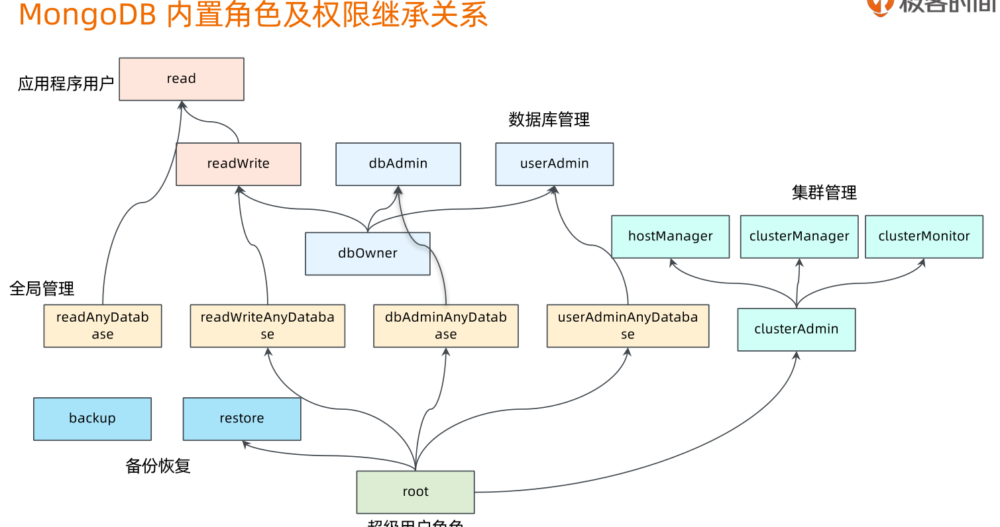

# MongoDB的安装与运行

本文目的：**在win10 64位操作系统下，从0开始安装部署一套单机运行的MongoDB开发环境**

具体内容包括：

- MongoDB的安装
- 配置文件的部署
- 客户端连接

希望本文可以对MongoDB新人有个指导，帮助大家在win10本地建立一个基本MongoDB开发环境。

[TOC]

## 0. Mongodb初识

资料：

- [官方文档](https://docs.mongodb.com/)
- [官网](https://www.mongodb.com/)

## 1. 安装MongoDB

这里演示如何在windows环境中安装mongodb数据库。

安装大致有几个步骤：

1. 下载安装包
2. 执行安装程序
3. 设置系统变量
4. 启动服务
5. Shell终端连接
6. Compass连接

下面就逐一做一个说明

### 1.1 下载安装包

处于免费的考虑，选择的是Mongdb社区版。

当前最新版本是5.0.3，[下载地址](https://www.mongodb.com/try/download/community)

这里给出5.0.3版本安装文件的地址：[安装文件下载](https://fastdl.mongodb.org/windows/mongodb-windows-x86_64-5.0.3-signed.msi)

下载后得到以下文件：


### 1.2 执行安装程序

安装程序执行很便捷，需要注意有两点：

一是安装完成后，建议重启系统；

二是在Service Configuration阶段。建议把启动程序MongoD安装成系统服务，如下图：



### 1.3 设置系统变量

安装完成后，为了在命令行中方便调用，建议在环境变量PATH添加BIN目录。

设置完成后，建议重启Windows系统。

### 1.4 安装确认

进入命令行窗口，输入mongo指令，如能看到下图的界面，说明安装成功。可以核对以下安装的版本。



## 2. 加固安全性

官方默认安装的环境是没有任何安全措施的“裸奔”环境，即使作为开发环境也是不安全的。

重要的事情说三遍：

- 不要裸奔！
- 不要裸奔！
- 不要裸奔！

MongoDb安全性体现在认证、网络控制、加密三个方面。

开发环境通常在“认证”和“网络控制”两个方面进行加固，一般做以下操作：

1. 修改网络端口、访问IP
2. 设置root角色，配置文件开启认证功能
3. 重启服务
4. 用root角色登录，建库，新建库Admin，库用户
5. 使用库用户登录

### 2.0 关于启动配置文件

### 2.1 安全认证

1. 创建全局admin用户，角色：dbAdminAnyDatabase，仅管理，无数据读写权限
2. 创建test库的admin用户，角色：dbAdmin，仅管理，无数据读写权限
3. 创建test库的test_readwrite用户，角色dbOwner，仅读写，无管理权限
   1. ? 是否可以新建表？

角色树参考下图：



### 2.2 网络控制

端口：28001

允许访问的客户端

### 2.3 配置文件示例

```txt
# mongod.conf

# for documentation of all options, see:
#   http://docs.mongodb.org/manual/reference/configuration-options/

# Where and how to store data.
storage:
  dbPath: C:\MongoDB\Data
  journal:
    enabled: true
#  engine:
#  wiredTiger:

# where to write logging data.
systemLog:
  destination: file
  logAppend: true
  path:  C:\MongoDB\Log\mongod.log

# network interfaces
net:
  port: 28001
  bindIp: localhost

#processManagement:

security:
  authorization: enabled

#operationProfiling:

#replication:

#sharding:

## Enterprise-Only Options:

#auditLog:

#snmp:

```

## 3. 检查

重新连接，如下。如能连接上说明设置成功

```shell
C:\Users\wang>mongo localhost:28001/test -u test_admin -p abc1234
```
